# Costumes

## Wasteland Weekend

My wasteland look has evolved a lot! Most of the textiles were customized from found objects. I made all of the necklaces, jewelery, and belts. In the second, third, and fourth photos I created the skirts and top from scratch from a vintage military drag chute.

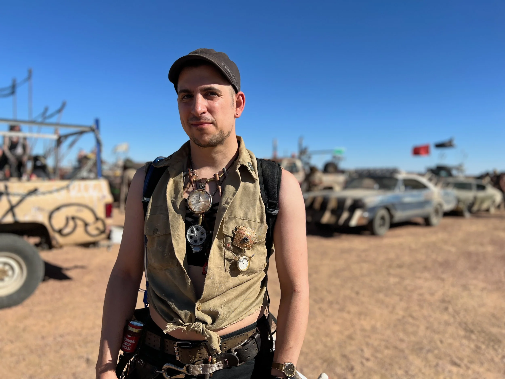

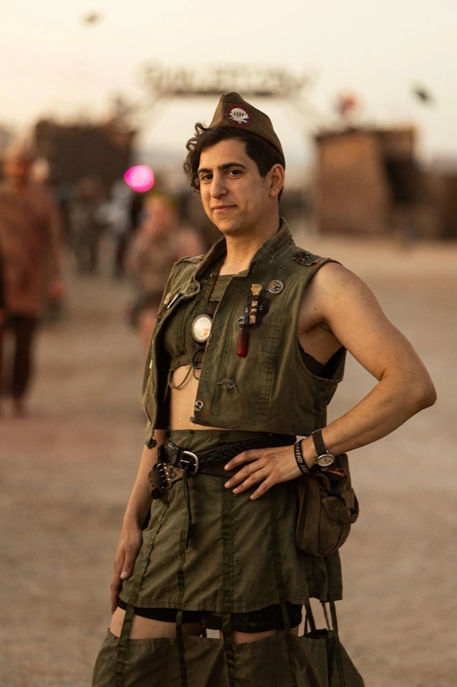

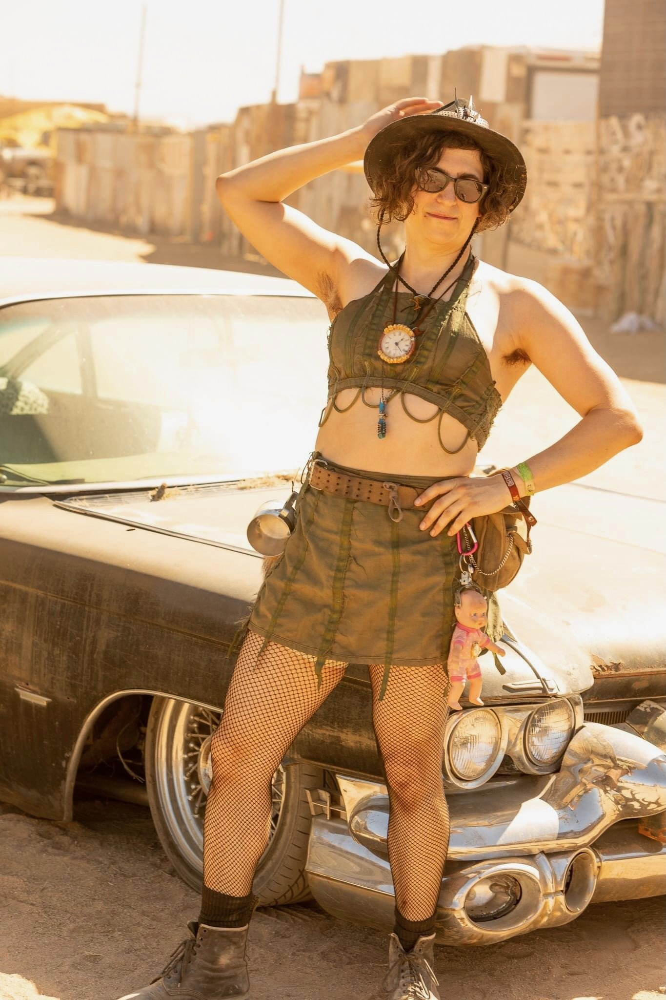

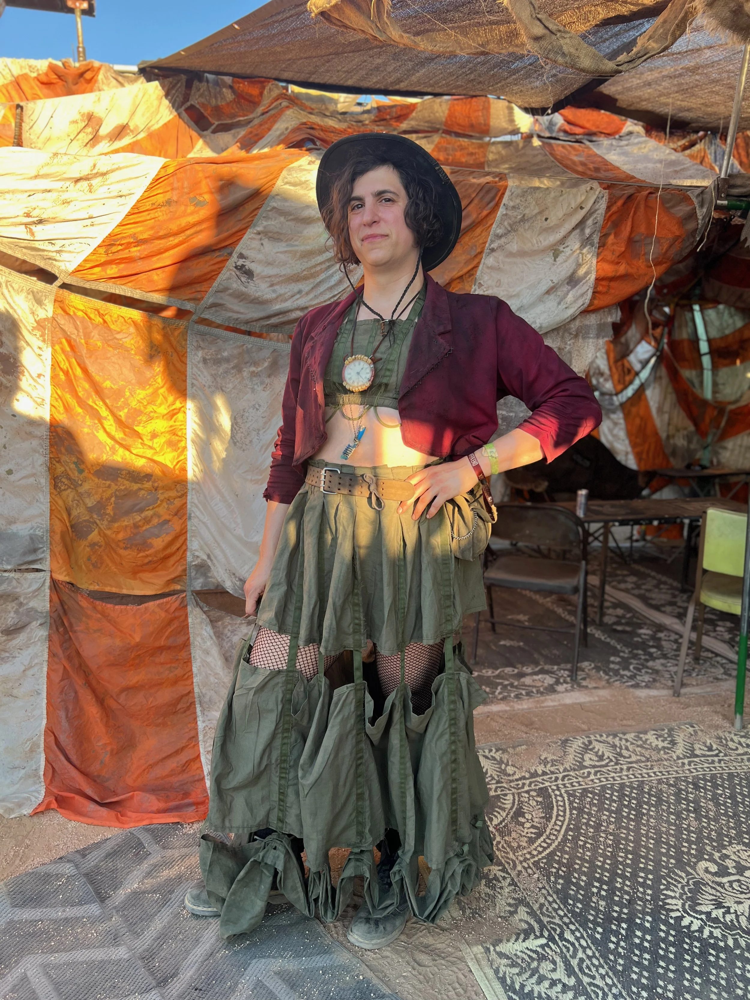

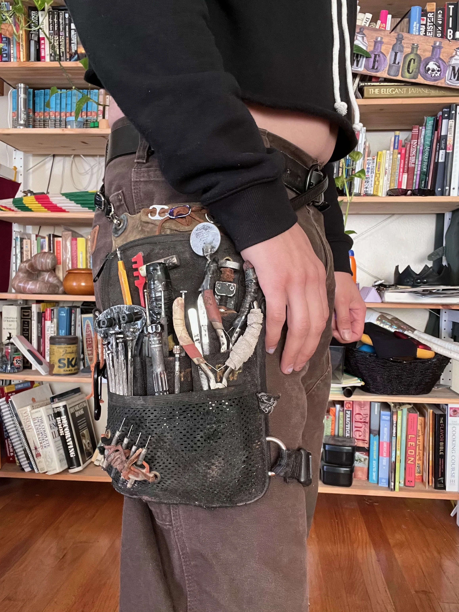

## Neotropolis

I have an array of outfits for Neotropolis. In the first photo I made the fascinator I am wearing out of lighting gels, hot glue, and a toothpick. The second photo was made from scratch including the harness. The third photo was a combination of thrifted items to create an elegant corporate space look. The hat in the 4th photo I designed, 3D printed, and soldered up. The mechanic garb in the 4th photo was assembled from found pieces but the harness was my custom design with 3D printed and fabric elements.

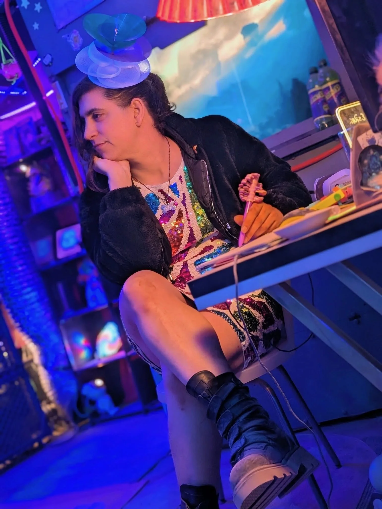

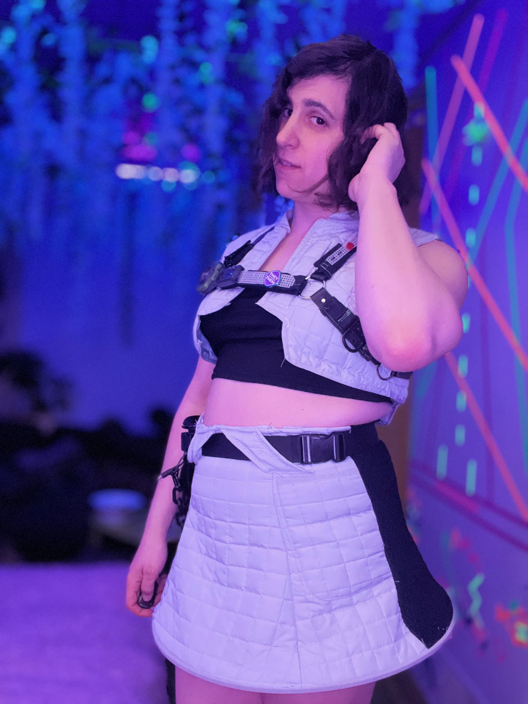

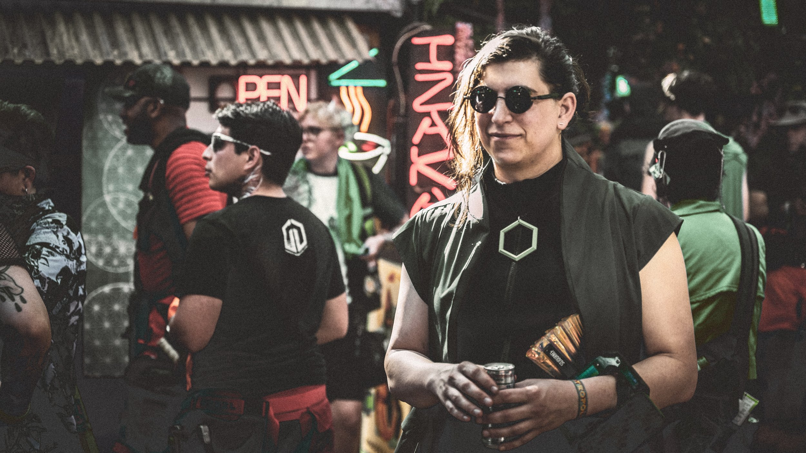

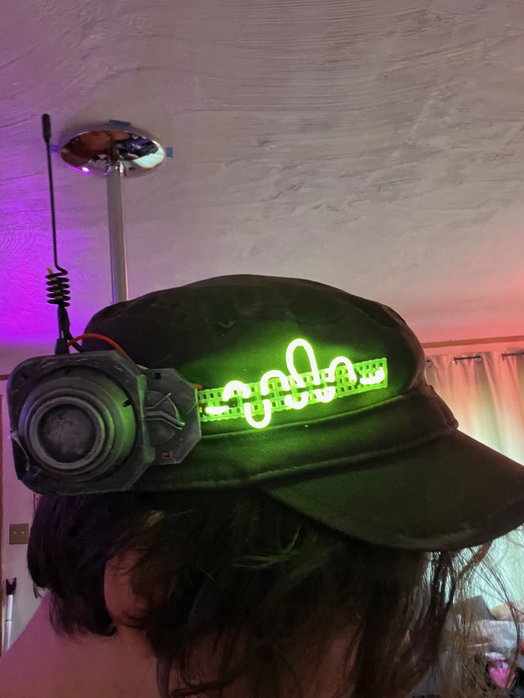

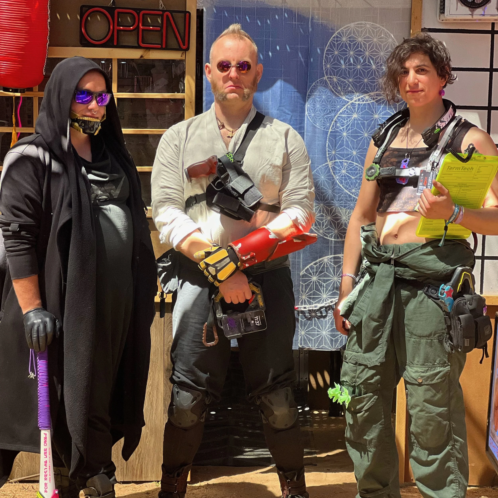

## The Wizard

For the Wizard I handmade the coat, the slip robe, and the hat. I also designed and built the glowing staff (it does not shoot fire)

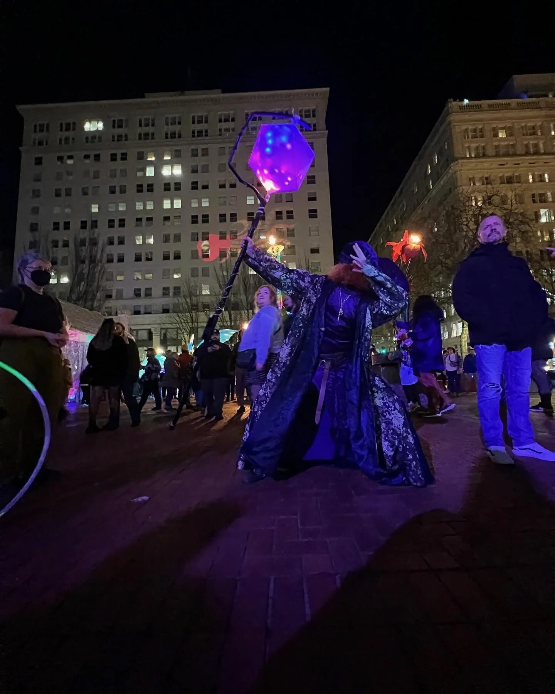

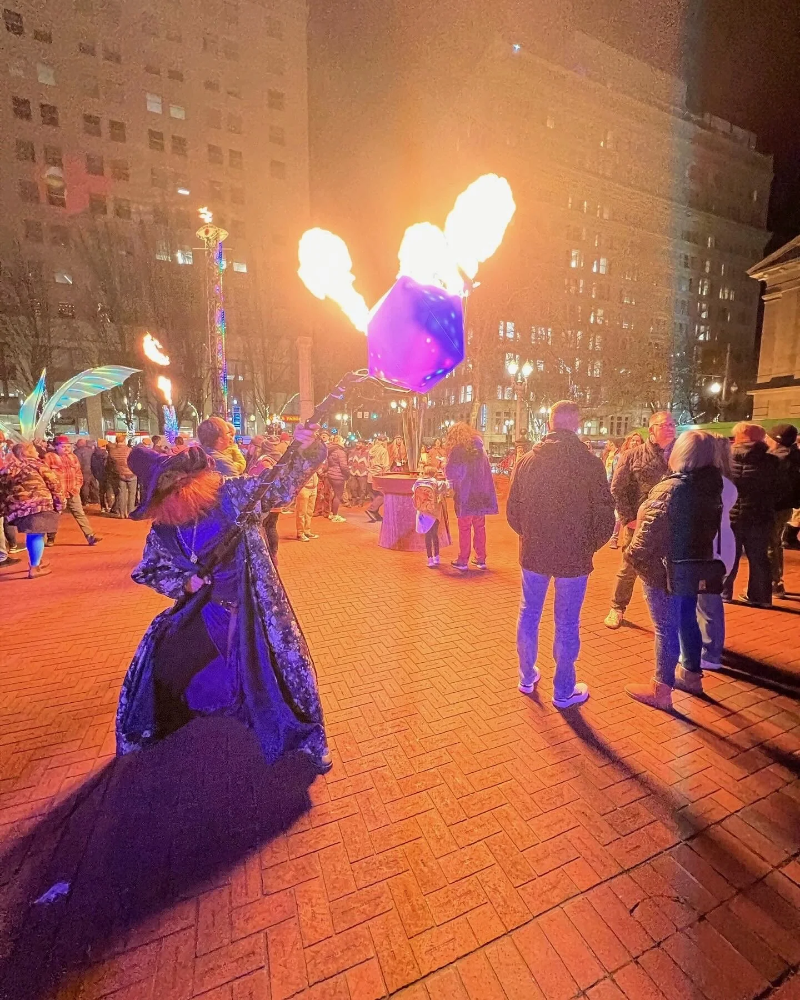
