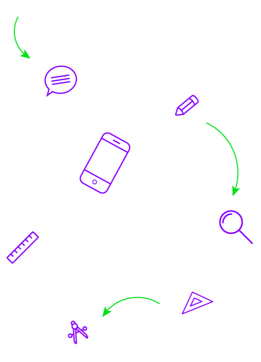
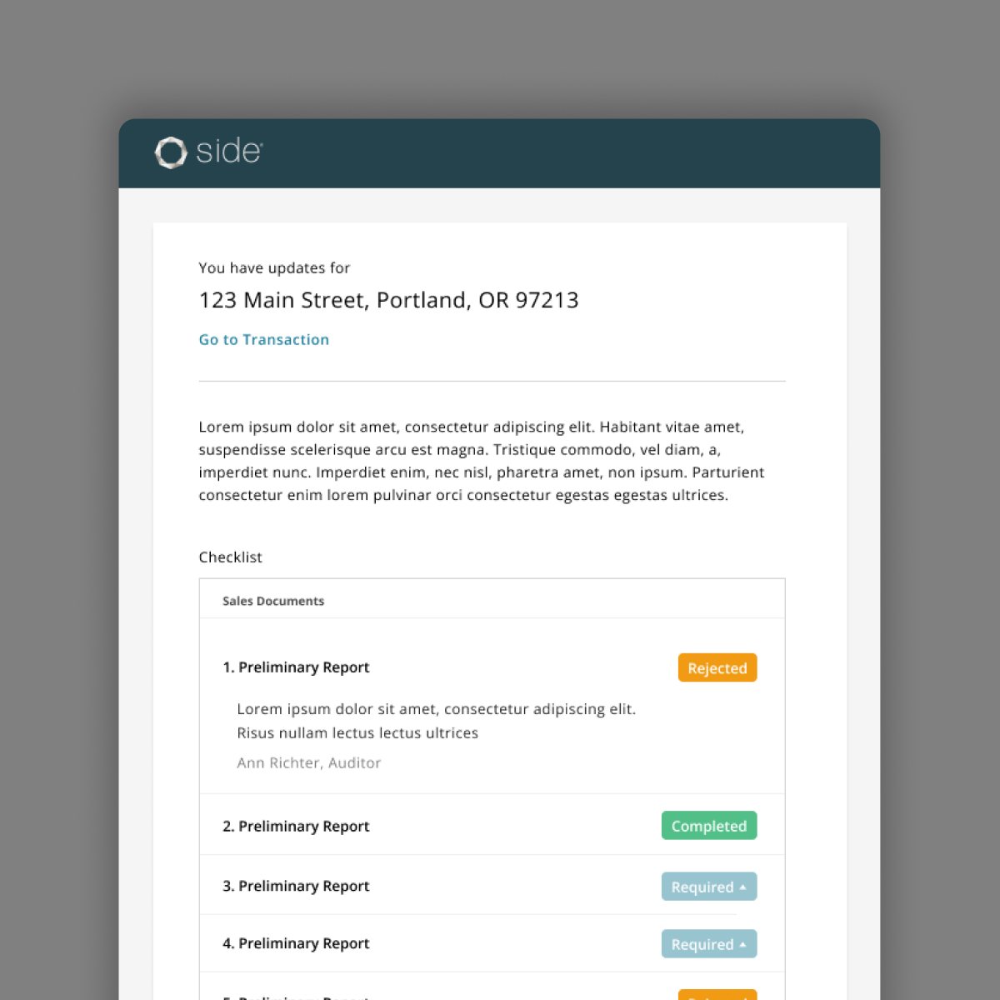
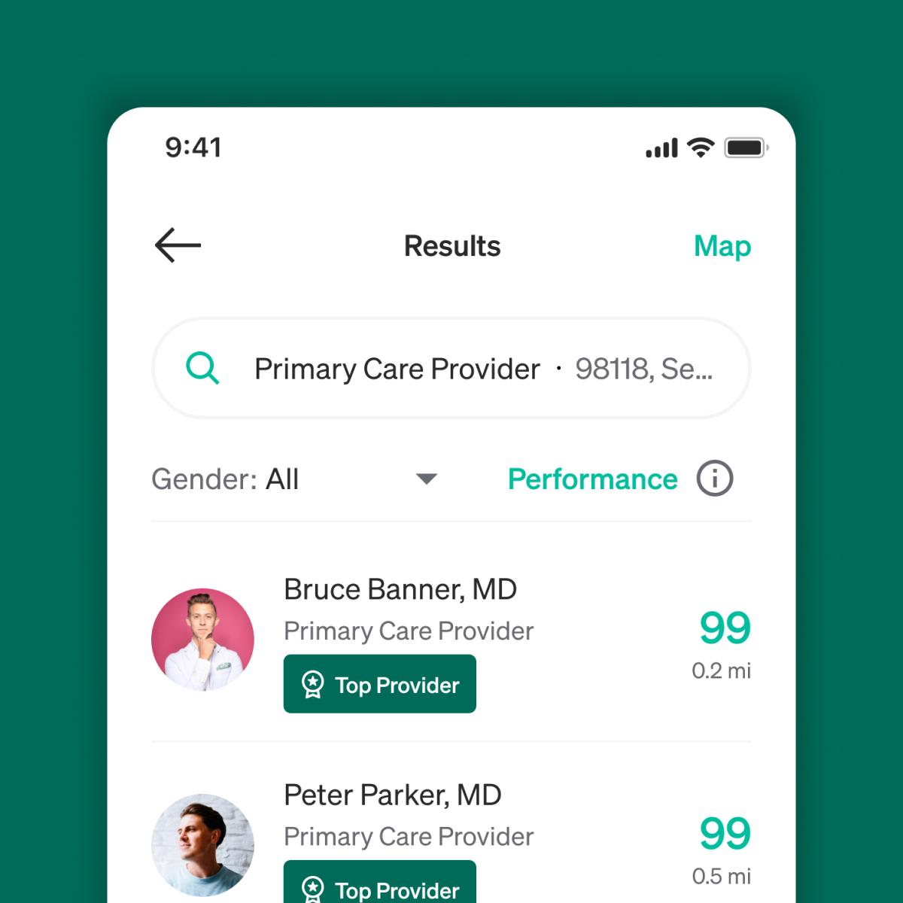
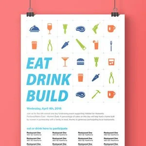
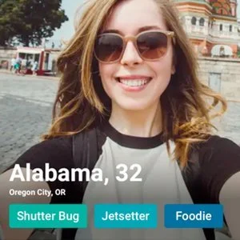
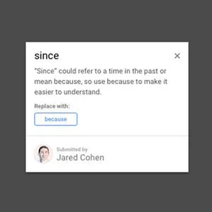
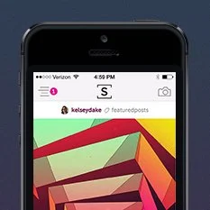
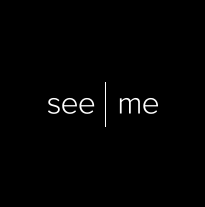

# I craft intuitive and elegant experiences that put users first.

I’m a UI/UX & Product Designer with over 15 years of experience working with both large and small tech companies. I’m passionate about solving complex problems and creating products that are not only visually appealing but also highly functional. I rely on thorough research to guide my design decisions, ensuring that every solution is rooted in user needs and data-driven insights.

## Professional work

# Side

Side Inc. helps top real estate agents build independent, luxury brands with a comprehensive suite of tools and services. At Side, I led the design of a custom auditing system that boosted auditor efficiency by 3x, using user research and workflow analysis.

# Healthcare Efficiency

This companies mission is to transform the healthcare economy but needed help handling volume. I worked on the flagship iOS app and built their internal adjudication tools.

## Other projects

*Habitat for Humanity*

*Sony Playstation Parents Guide*

*Clover User Flows*

*Perka iOS App*

*Perka Enrollment System*

*Picme Dating App*

*Irregardles.ly*

*See.me iOS App*

*See.me Website*
