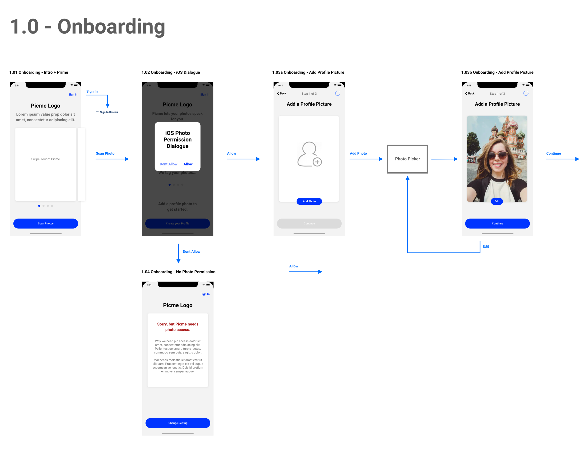
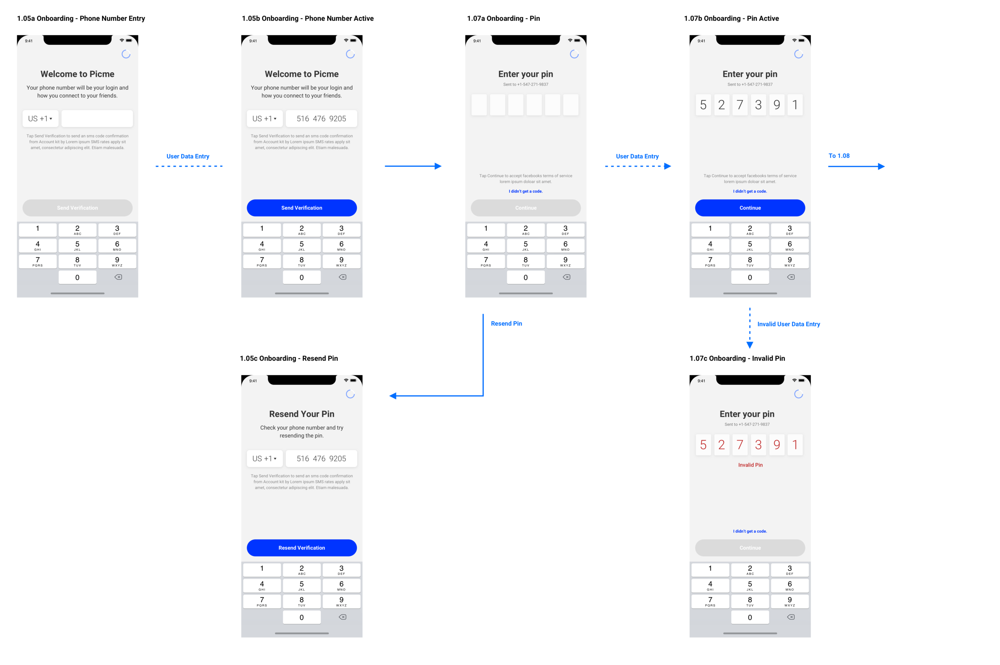
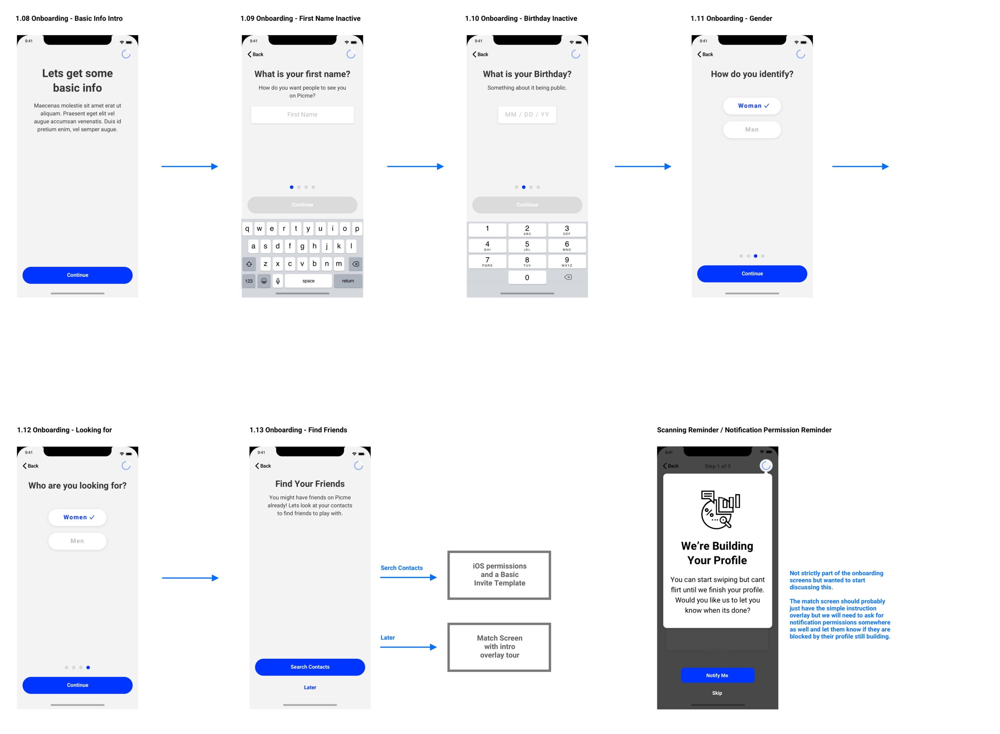
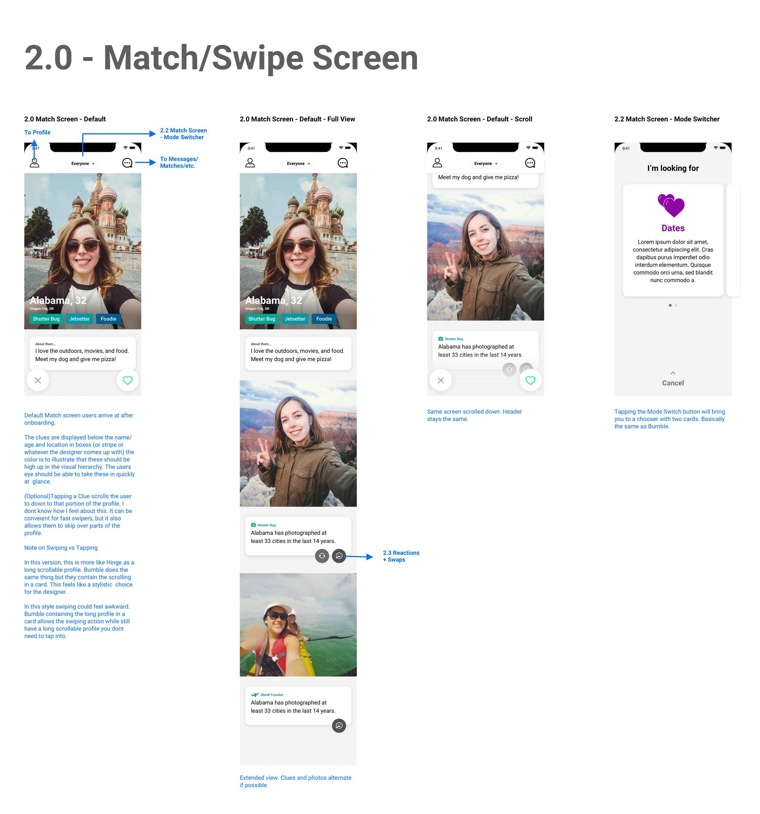
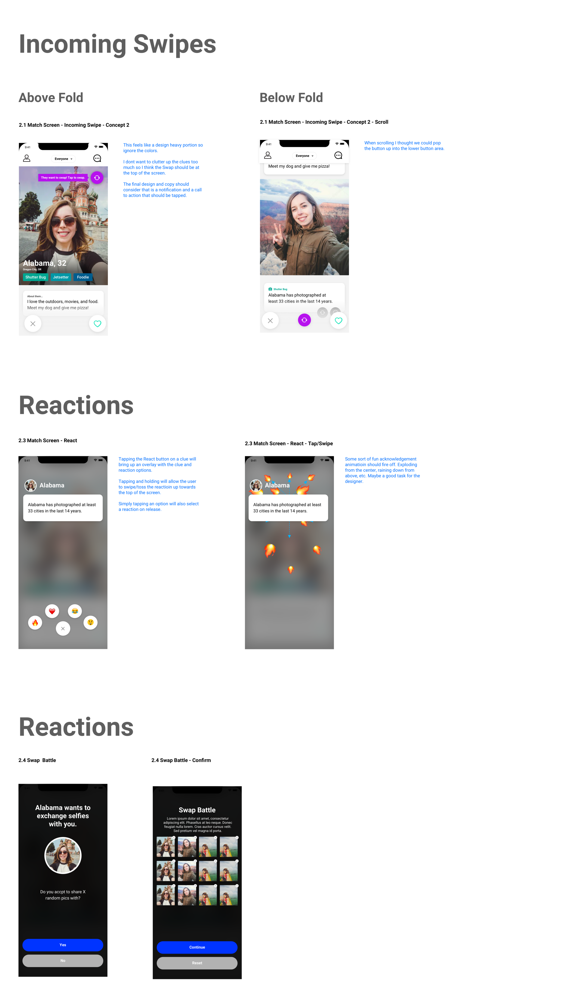

# Picme Dating App

Role: UX/UI & Product Design | Process & Skills: Competitive Research, User Research, Task Flows, Wire Frames, UI Design

Picme came to me with a new spin on the swipe to match dating app. They wanted to help users get high quality matches through comparing their picture libraries. The app scans each users pictures and assigns tags to each one. When users match, the app generates a quiz that helps get users to know each other. Questions like “Who do you think is the bigger foodie?” use the photo tags so users can discover more about each other without pickup lines.

## Goals

Onboarding should focus on getting users to allow access to their photo library.

Get people swiping and matching as quickly as possible.

