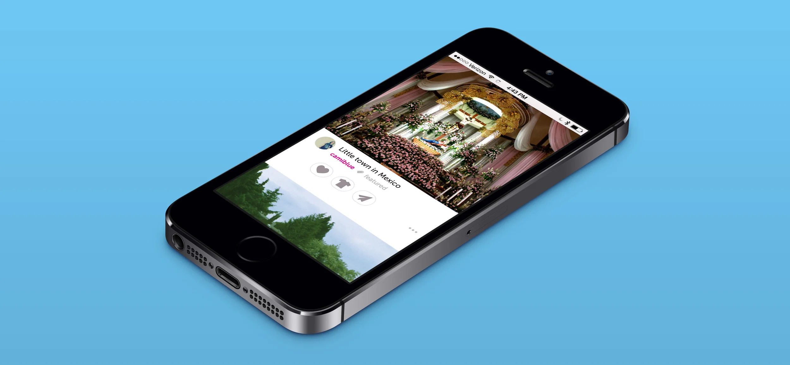
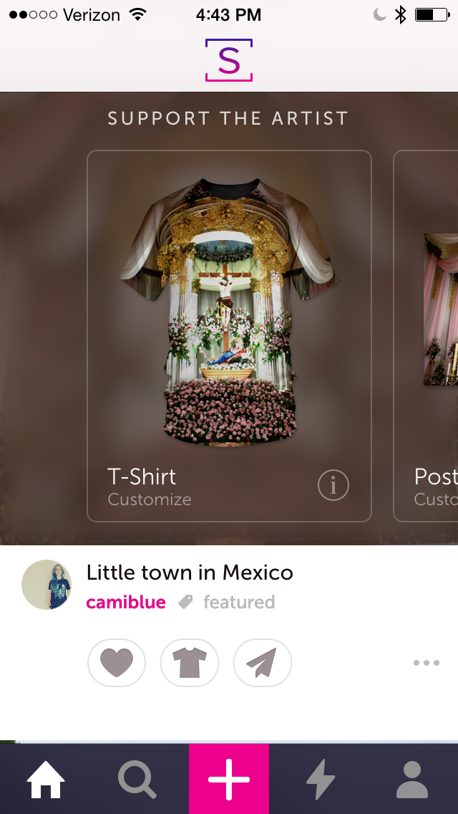
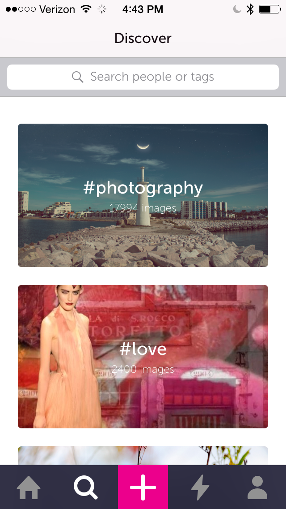
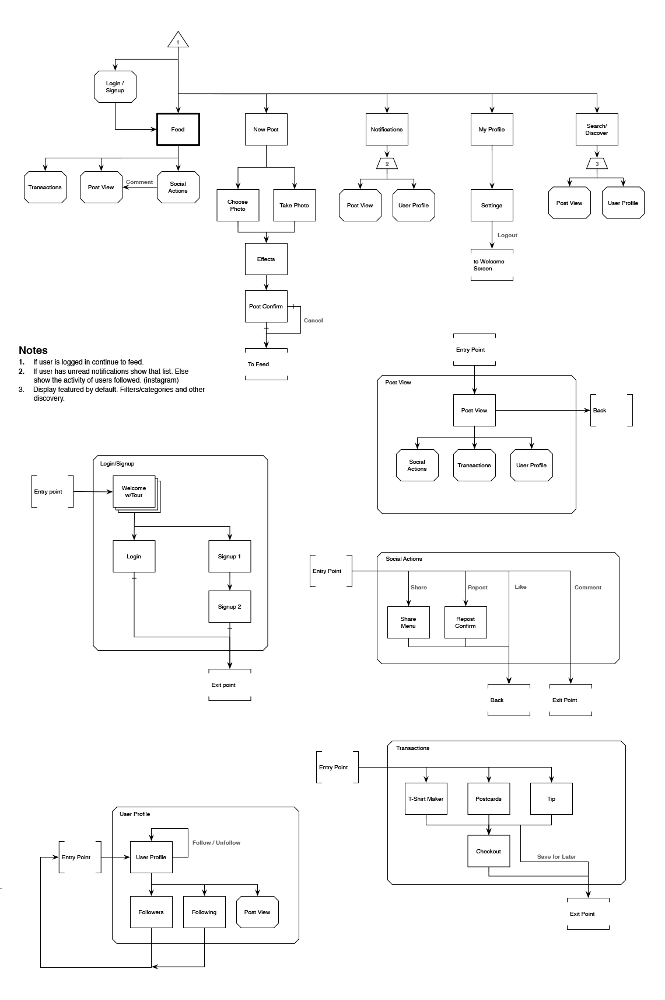
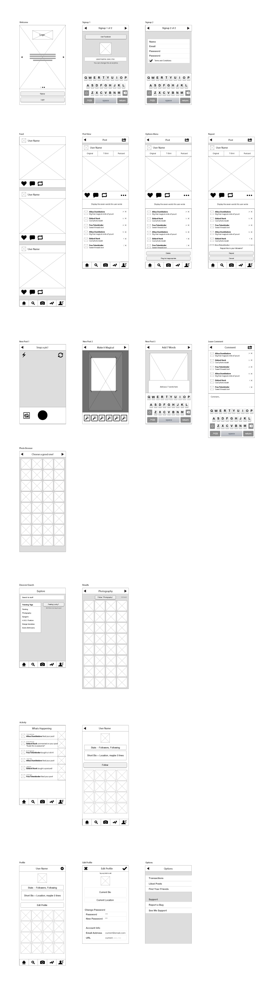

### User Story:

As a See Me user I would like to be able to browse my feed easily and quickly so that I can give support to the artists I follow.

The See.Me iPhone App was a major undertaking for the company. We wanted to create an app that would allow someone to quickly checkout new artwork while standing in line at the grocery but also would allow them to deeply interact with and support the See Me artists. Influenced heavily by other social media apps we went with a familiar model the users feed is the anchor for all of the other views.

### Final Designs

*This is the users feed. From here they can browse work and support artists they follow.*

*Clicking the T-Shirt icon allows you to create a custom t-shirt or postcard of this artists work.&nbsp;*

Clicking the T-Shirt icon allows you to create a custom t-shirt or postcard of this artists work.

*Tagging allows users to find new artists and artwork to purchase.*

### App Architecture

### Wireframes

