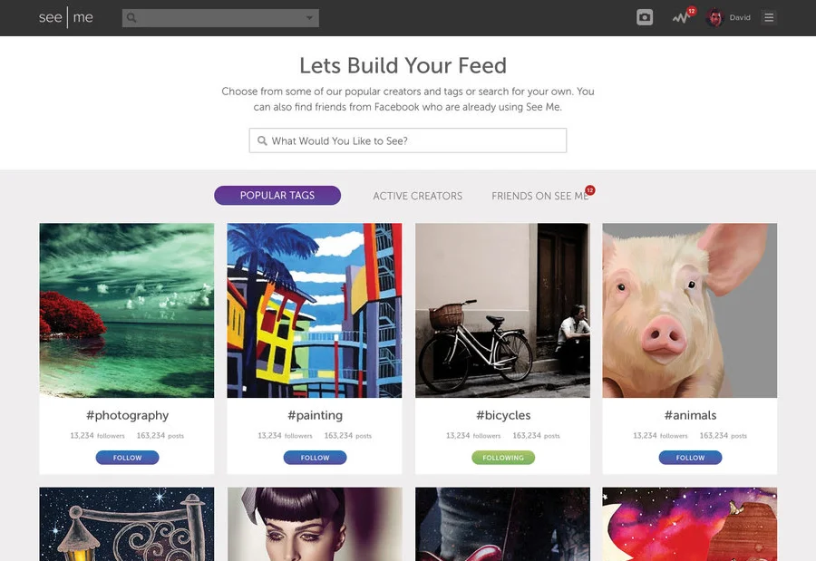
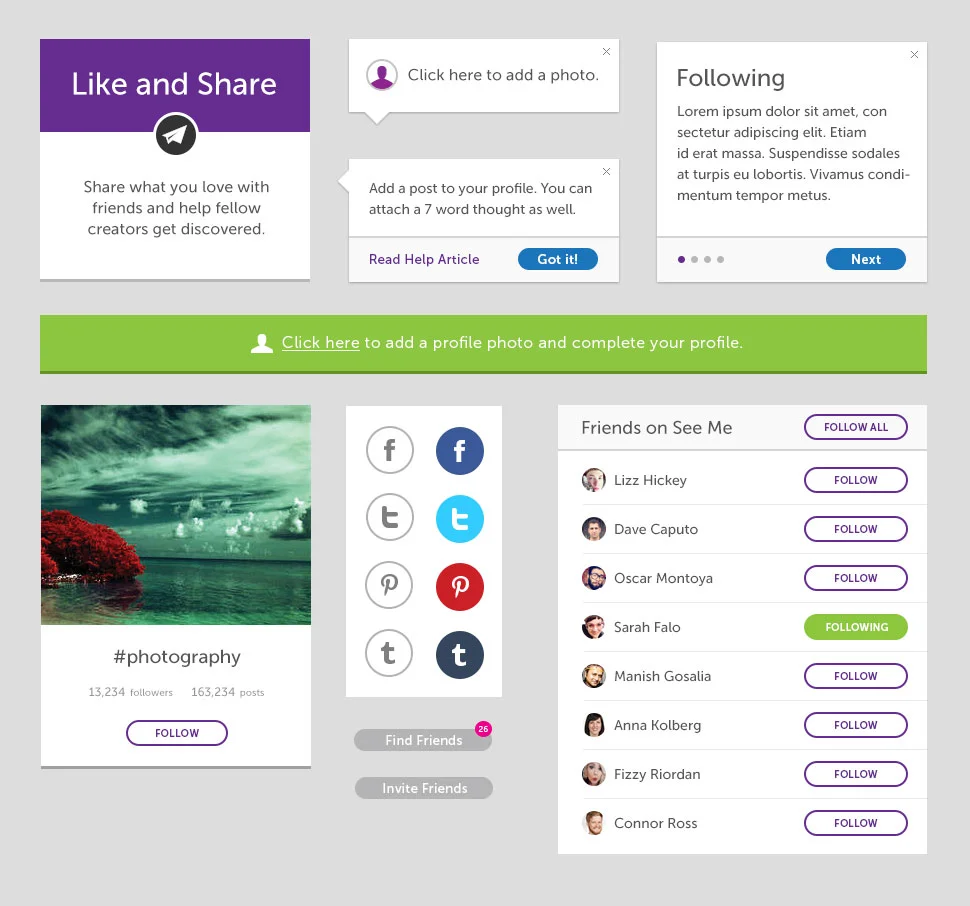
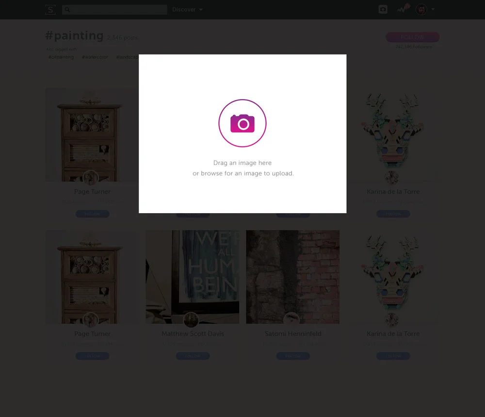
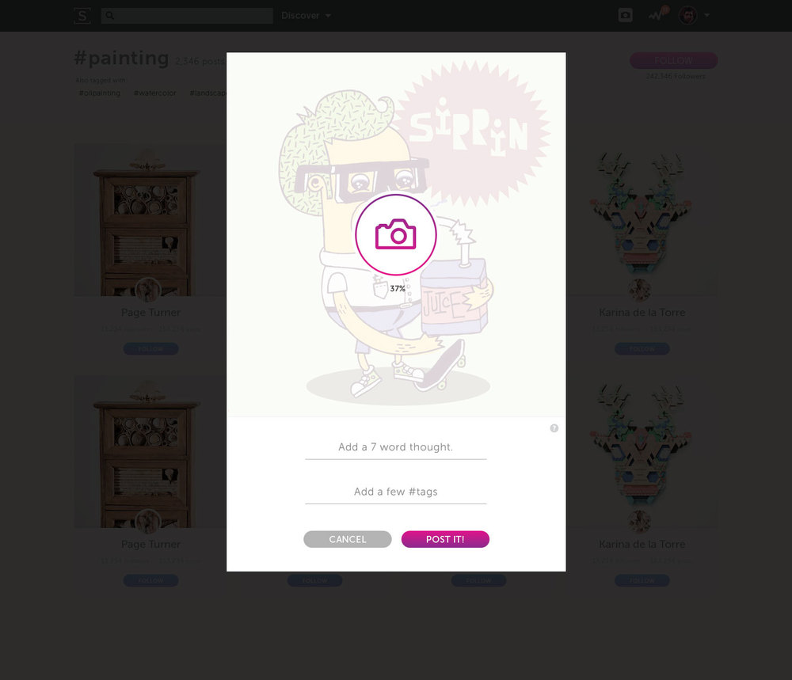
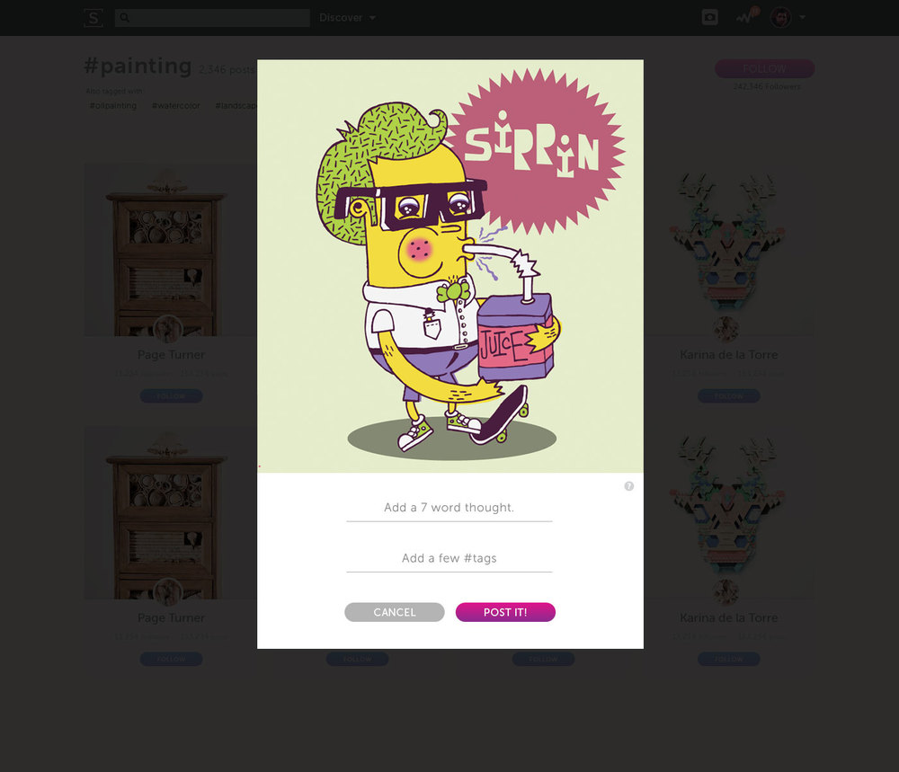
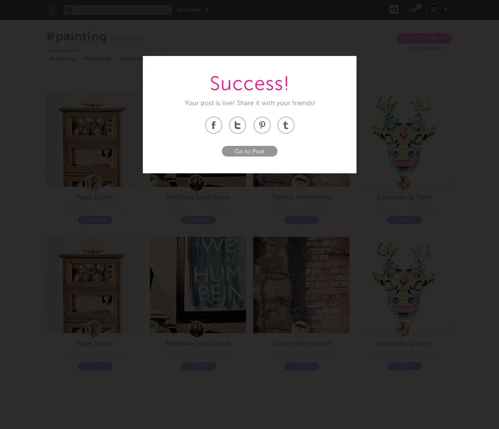
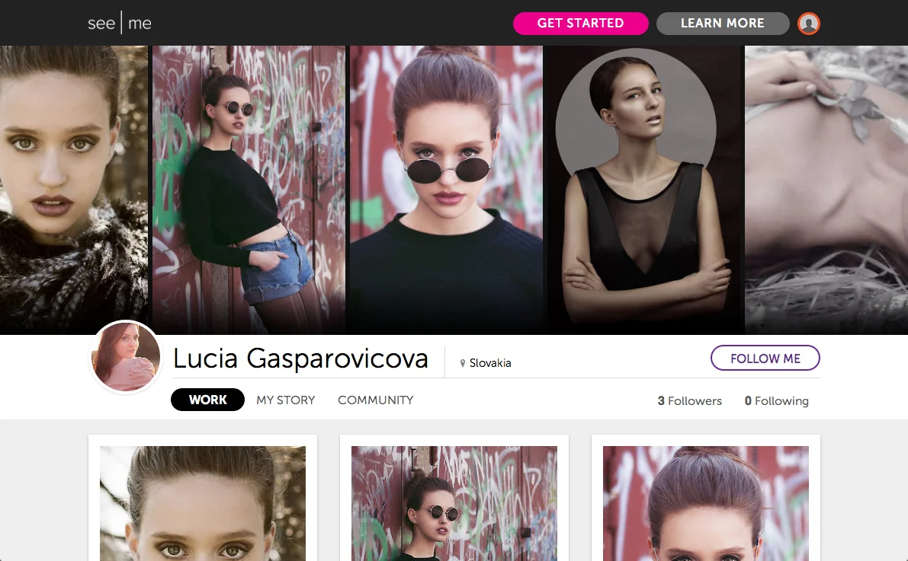

# See.me Website

Role: UX/UI Design, Front-End Developer | Process & Skills: Stakeholder Interviews, Competitive Analysis, User Interviews, UI Design, CSS/SASS, Javascript, Backbone.js

## Goal

Our small team wanted to build a site that would offer beautiful portfolios, marketing support, and exposure to artists all over the world.

## The Challenge

When we first started See.Me our main goal was to build a membership mainly made up of artists. We had a leg up on this with our competitions bringing in thousands of artists from all over the world. We the realized that in order to keep our artists around they would need an audience. The strongest community would be a balance between artists and supporters.

Onboarding set the tone for our redesign. The first step helped you curate a feed of artists.

We'd found that when the network was only artists and the main ui was a vote & comment feature that everyone would just spam each others walls looking for votes. We were convinced a ui tweak would help foster a more balanced community.

But how could we make the site relevant for supporters? What did a supporters profile look like if they did not have any art?

## Solution

Giving the supporters an important role by their profile into a curated collection. This helped build an ecosystem based on real appreciation for each others work.

## Style Guide

See.Me's redesign brought with it a great opportunity to get some consistency back in our styles. I created a style guide for some commonly used elements that were then used to define a standard set of UI elements.

The theme changed over time but the basic style guide allowed our small team to make these changes rapidly without breaking anything.

## Media Uploader

The See.Me media uploader got a facelift and a new 7 word caption feature. We wanted to make it as streamlined as possible so while the image is uploading you can move on to complete the next step. Upon success you can share it easily to social media.

## A More Social Profile

The See Me profiles needed to be a more social experience. The header of our profiles were updated to highlight the artists popular posts and promoted the follow feature. I also streamlined our menu system to eliminate decision paralysis.

We added feeds to the site and after a long series of experiments decided to move away from using the word "Support" in favor of the simpler and more social understood "Follow" button. The rest of the profile header got a much needed update to make it cleaner and clearer.
